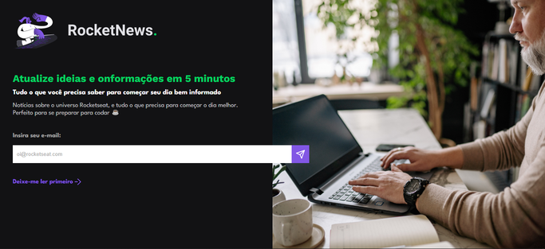
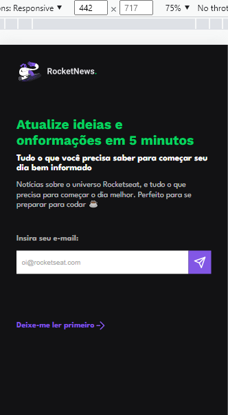

<h1 align='center'>Rocket News ✉</h1>

  <a href="#-sobre">Sobre</a>&nbsp;&nbsp;&nbsp;|&nbsp;&nbsp;&nbsp;
  <a href="#-prints">Prints</a>&nbsp;&nbsp;&nbsp;|&nbsp;&nbsp;&nbsp;
  <a href="#-tecnologias">Tecnologias</a>&nbsp;&nbsp;&nbsp;|&nbsp;&nbsp;&nbsp;
  <a href="#-licença">Licença</a>&nbsp;&nbsp;&nbsp;|&nbsp;&nbsp;&nbsp;

🚀 Projeto concluído ✅

## 💻 Sobre

Este projeto é uma página de captura simples com formulário de Newsletter. O projeto é mais um dos desafios propostos no Curso do Discover da Rocketseat. [Link para página do desafio](https://efficient-sloth-d85.notion.site/Desafio-RocketNews-2e2c5d56b41f4b13a7d8df6b5affc0ec#caea03b3acf1440a95f39ca50c563fc5).

## 📷 Prints

 

## 🛠 Tecnologias

- Linguagens: 
    - [HTML](https://developer.mozilla.org/pt-BR/docs/Web/HTML) 
    - [CSS](https://developer.mozilla.org/pt-BR/docs/Web/CSS)
    - [JavaScript](https://www.javascript.com/)
- Ferramentas / Recursos: 
    - Editor: [Visual Studio Code](https://code.visualstudio.com/)
    - Fontes: [Work Sans](https://fonts.google.com/specimen/Work+Sans?query=work+sans) e [League Spartan](https://fonts.google.com/specimen/League+Spartan?query=spartan)

## 📝 Licença 

O projeto está sob a [Licensa MIT](./LICENSE) 

Qualquer pessoa pode usar, clonar e contribuir com este projeto 👍😁 

